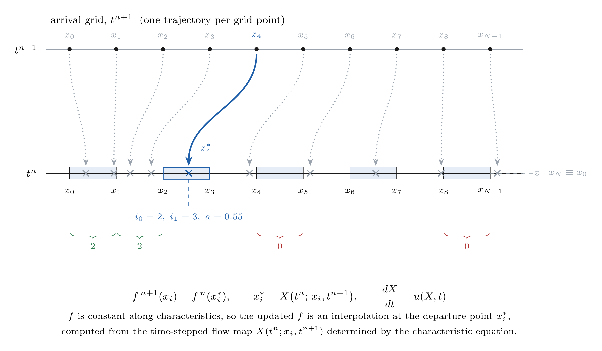
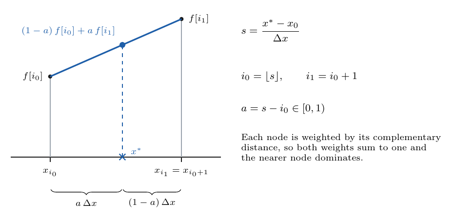
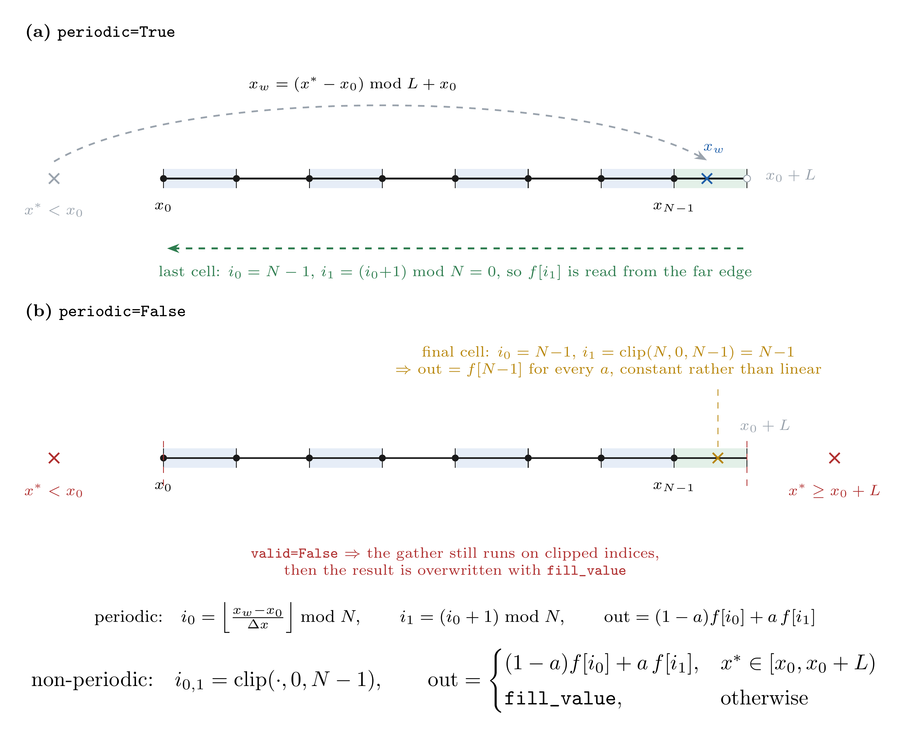
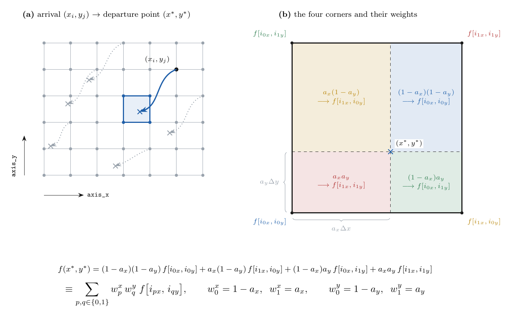
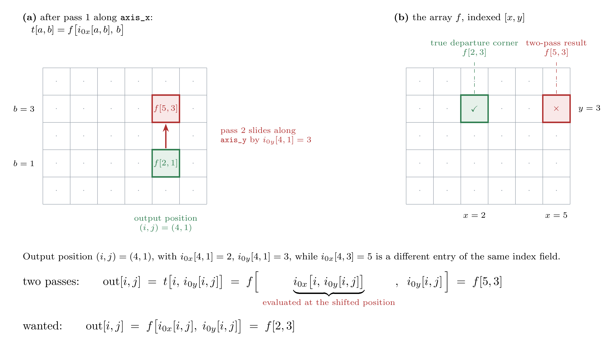
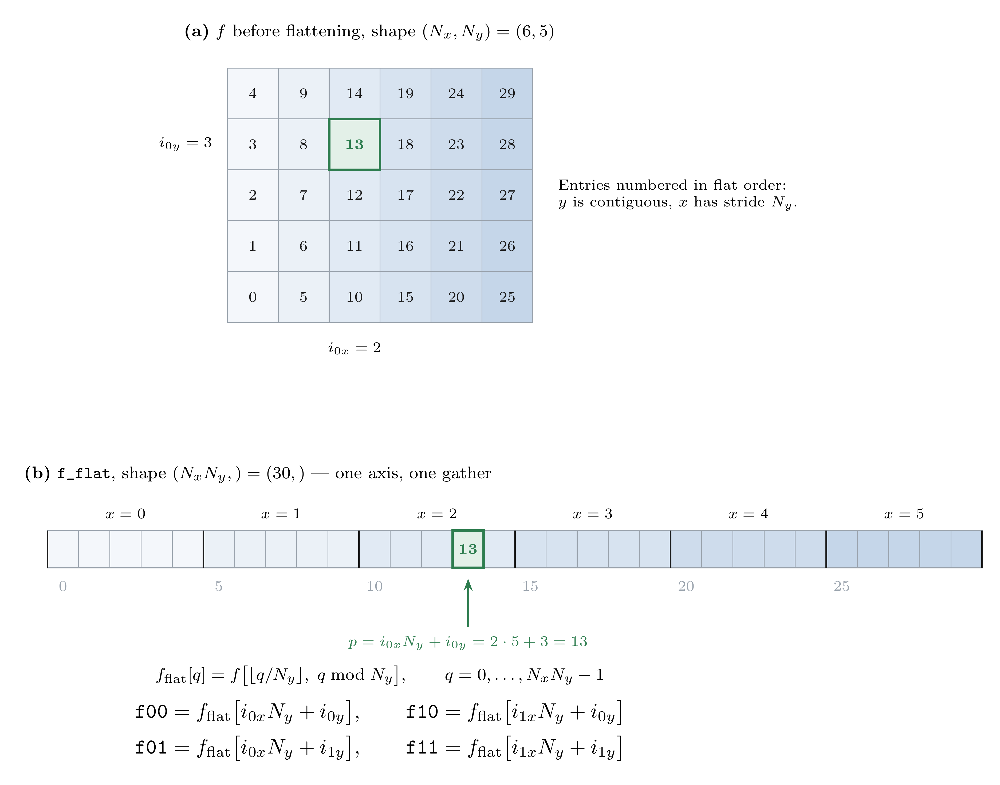
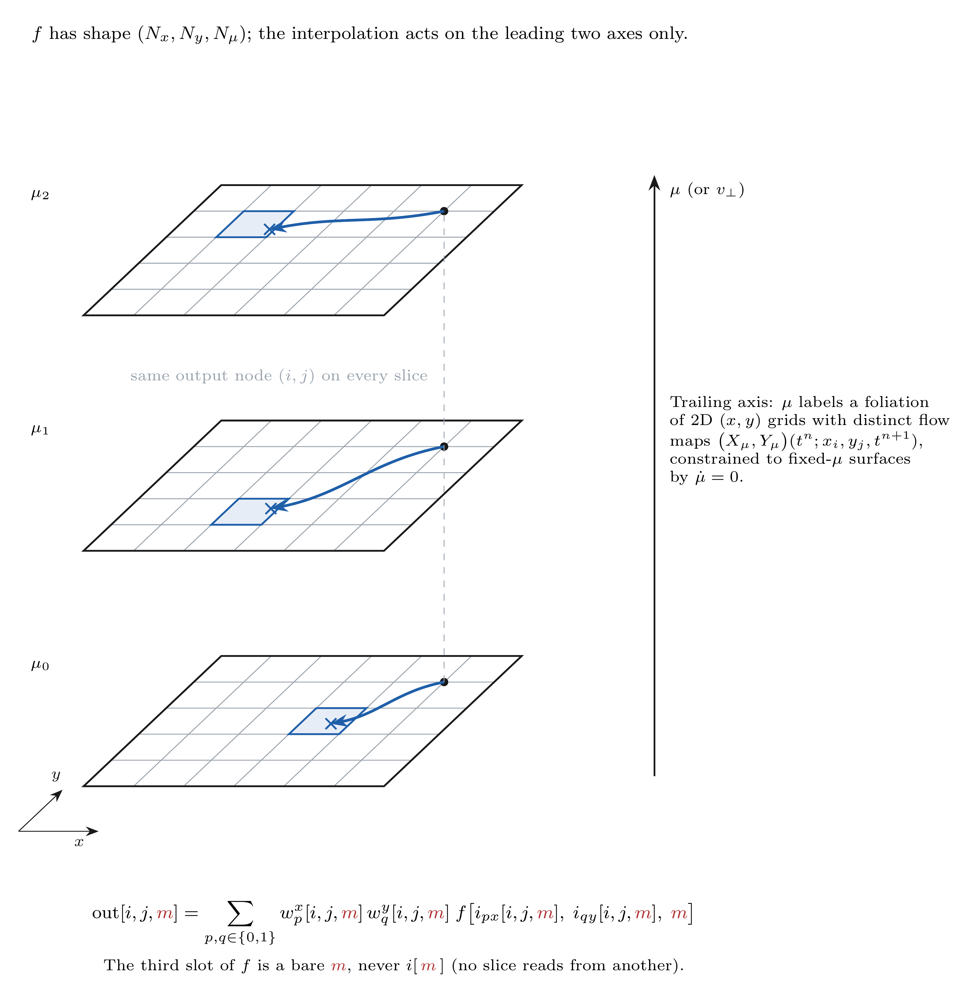

# Figures: geometry of the semi-Lagrangian sceme.

Every docstring and comment block in
[`interpolation.py`](../../interpolation.py) has a figure here.
Sources are in [`tikz/`](tikz/); the PNGs below and the PDFs beside each source are build products.

The distribution array is `f` with axes $(x, y, \mu)$, `axis_x = 0`,
`axis_y = 1`, and a trailing velocity-space axis the interpolator does not act on.
Figures draw x horizontally and y vertically, so `take_along_axis` along `axis_x`
moves horizontally and along `axis_y` moves vertically. Grid spacings $\Delta x, \Delta y$;
lengths $L_x = N_x \Delta x,\, L_y = N_y \Delta y$; the periodic domain is $[x_0, x_0+L_x)$, so
$x_N \equiv x_0$ is a ghost point and is never stored.

Build: `make -C docs/figures` (needs TeX Live with `pgf` and `standalone`, plus
`pdftoppm` from poppler-utils).

---

## Figure 1 — The backward step in one dimension

Covers: module docstring.

Every arrival point $x_i$ of the uniform grid follows one trajectory, traced backward through the flow map for one step to a departure point $x^{\ast}_i$. On cells the discrete map is neither injective nor surjective. The first two cells receive two departure points each, cells $[x_4,x_5)$ and $[x_8,x_9)$ receive none. Each departure point evaluates $f$ on the bracketing grid indices (gathers) independently. The highlighted trajectory from $x_4$ lands at $x^{\ast}s_4$ in $[x_2,x_3)$, giving $i_0=2$, $i_1=3$, $a=0.55$; Fig. 2 shows that cell enlarged. The updated $f$ is an interpolation at the departure point $x^{\ast}_i$, computed from the time-stepped flow map $X(t^n; x_i, t^{n+1})$ determined by the characteristic equation. The open circle is the ghost point closing the periodic domain.

[source](tikz/fig01-backward-step.tex) · [pdf](tikz/fig01-backward-step.pdf)

---

## Figure 2 — Linear interpolation, one cell wide

Covers: module docstring (the interpolation formula).

Linear interpolation across one cell. $s$ measures the departure point in cell units from the array origin; its integer part is the left index $i_0$, its fractional part is the local coordinate $a$. The two weights are $1-a$ and $a$, one per bracketing node: each node is weighted by its complementary distance, so the pair sums to one and the nearer node dominates (for this point). The 2D case (Fig. 4) is the same statement with areas.

[source](tikz/fig02-linear-interpolation.tex) · [pdf](tikz/fig02-linear-interpolation.pdf)

---

## Figure 3 — Wrapping, clipping and the validity mask

Covers: The `periodic` branches of `interp1_linear_x`.

The two branches of the index construction. **(a)** Periodic: the departure point is folded into $[x_0,x_0+L)$ before indexing, and the index pair itself wraps, so the shaded final cell interpolates between $f[N-1]$ and $f[0]$; the ghost point of Fig. 1 is supplied by $i_1=0$ rather than stored. **(b)** Non-periodic: the mask decides what survives and the clip keeps the gather in bounds. One consequence of the clip is visible on the right: inside the final cell $i_0$ and $i_1$ collapse onto $N-1$, so the interpolant is constant there rather than linear. That cell is exactly the one the periodic branch closes with $f[0]$.

[source](tikz/fig03-wrap-clip-mask.tex) · [pdf](tikz/fig03-wrap-clip-mask.pdf)

---

## Figure 4 — Bilinear interpolation on the (x, y) plane

Covers: `interp2_bilinear_xy` docstring.

**(a)** The departure point of the characteristic through the arrival node $(x_i,y_j)$ is a 2D point, bracketed by $i_{0x},i_{1x}$ in $x$ and $i_{0y},i_{1y}$ in $y$. **(b)** That cell enlarged, with each sub-rectangle tinted and arrowed to the corner it weights. The four corners are gathered jointly and combined with products of the 1D weights, and the weight of a corner is the area of the sub-rectangle diagonally *opposite* it. The four weights sum to one and reduce to Fig. 2 whenever one of the local coordinates $a_x, a_y$ vanishes (i.e. whenever the departure point lands on a grid line).

[source](tikz/fig04-bilinear-weights.tex) · [pdf](tikz/fig04-bilinear-weights.pdf)

---

## Figure 5 — Why the gather cannot be split into two 1-D passes

Covers: the flattening comment in `interp2_bilinear_xy`.

`take_along_axis` varies the index along one axis while holding every other axis position fixed at the output position. Pass 1 is still valid: the intermediate array $t$ holds, at every position $(a,b)$, the correct $x$-gather *for that position*. Pass 2 reads $t$ at $(i,\,i_{0y}[i,j])$ rather than at $(i,j)$, and the $x$-index baked into that entry is $i_{0x}$ evaluated at the shifted position. Since $i_{0x}$ and $i_{0y}$ vary jointly over $(x,y)$, the two fields disagree there and the gather occurs in the wrong row. 

[source](tikz/fig05-two-pass-error.tex) · [pdf](tikz/fig05-two-pass-error.pdf)

---

## Figure 6 — The flat gather solution

Covers: the flattening comment in `interp2_bilinear_xy`.

Flattening `axis_x` and `axis_y` into a single axis of length $N_x N_y$ turns the index pair $(i_{0 x},i_{0 y})$ into the one index $p=i_{0 x} N_y+i_{0 y}$. Four corners means four such gathers, with $p\in \lbrace i_{0 x}N_y+i_{0 y},\, i_{1 x} N_y+i_{0 y},\, i_{0 x}N_y+i_{1 y},\, i_{1 x} N_y+i_{1 y} \rbrace $, all reading the same `f_flat`.

[source](tikz/fig06-flat-gather.tex) · [pdf](tikz/fig06-flat-gather.pdf)

---

## Figure 7 — The velocity axis rides along

Covers: final paragraph of the `interp2_bilinear_xy` docstring.

[source](tikz/fig07-batch-mu-axis.tex) · [pdf](tikz/fig07-batch-mu-axis.pdf)

---
